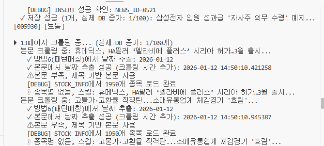
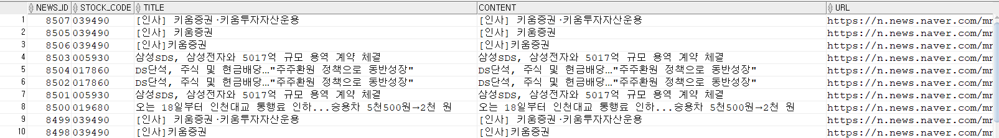
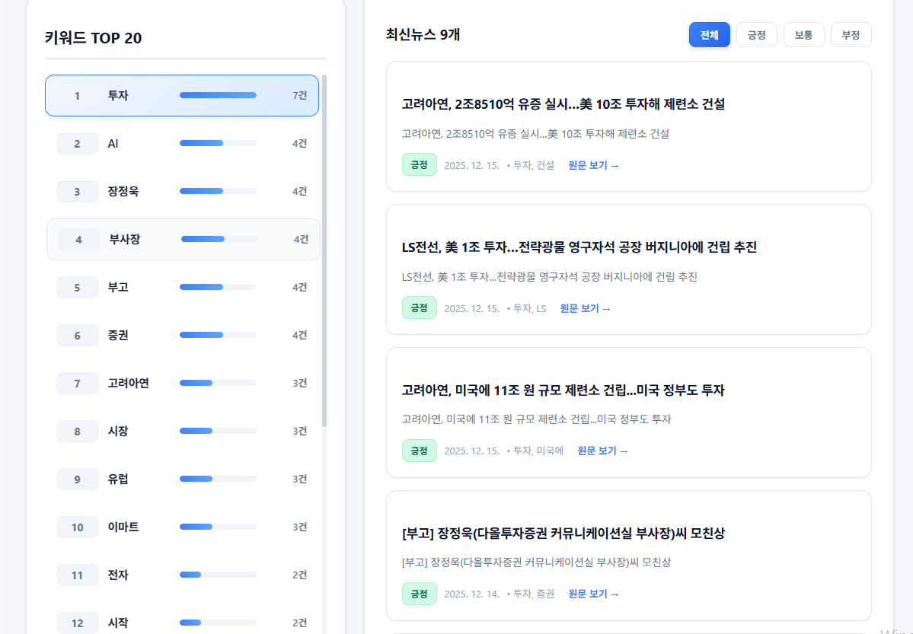
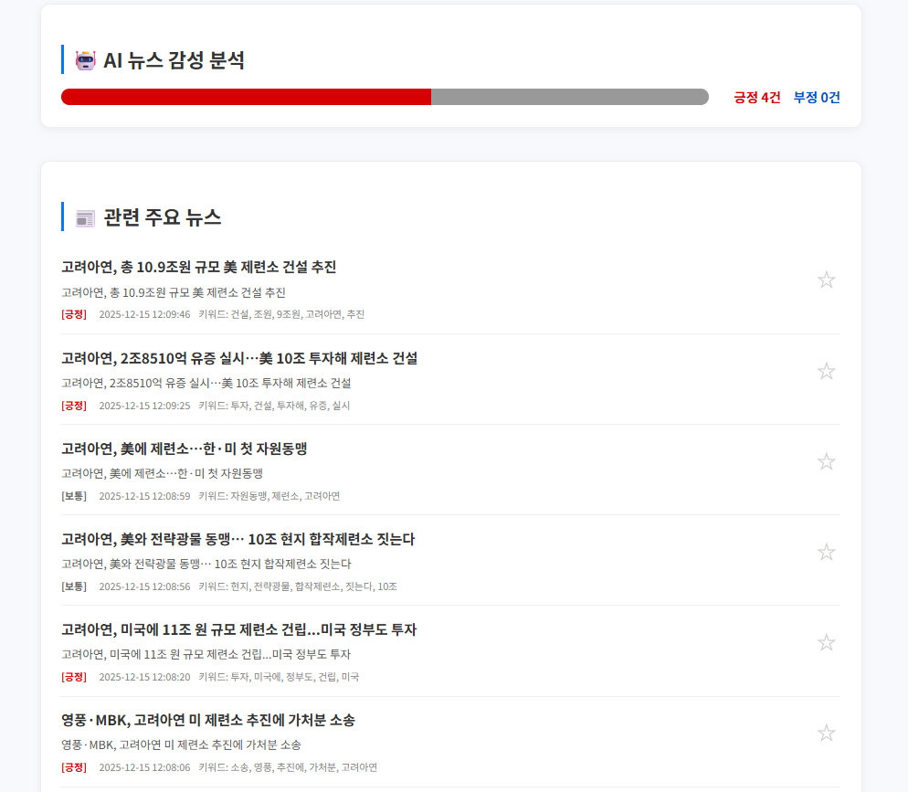
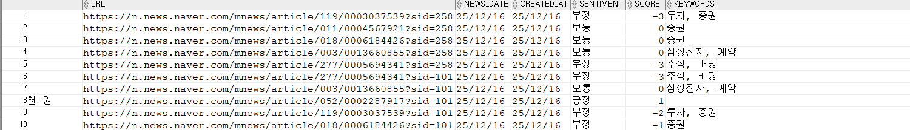
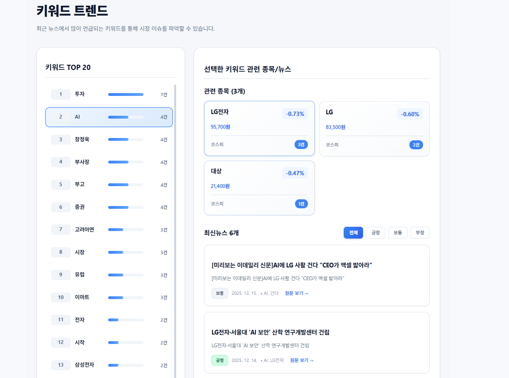

<div align="center">

# 📊 코스피 검색엔진
### Spring Boot · React · Oracle 기반 주식·뉴스 분석 플랫폼

<br>


<br>


<br><br>
</div>

---

## 📖 프로젝트 개요

**코스피 검색엔진**은 
주식 종목 정보와 뉴스 데이터를 수집·분석하여  
**시장 흐름, 종목 이슈, 뉴스 감성 및 키워드 트렌드를 종합적으로 제공하는**  
웹 기반 주식·뉴스 분석 플랫폼입니다.

뉴스 크롤링을 통한 데이터 수집부터  
감성 분석, 키워드 트렌드 분석, 검색 엔진, 관리자 운영 기능까지  
**데이터 수집 → 분석 → 시각화 → 운영 관리** 흐름을 중심으로 설계되었습니다.

- 개발 기간 : 1차: `2025.12.02 ~ 2025.12.09`, 2차: `2025.12.09 ~ 2025.12.16`
- 개발 인원 : `5명` 
- 개발 환경 : Spring Boot + React 분리 구조
- 배포 URL : http://3.236.44.225/
---

## 👨‍💻 담당 역할

- 🕷️ **뉴스 크롤링 및 스케줄링 담당**
  - 네이버 뉴스 자동 수집 시스템 설계 및 구현
  - Windows Task Scheduler 기반 자동화 스케줄링 구조 설계
  - 종목명 자동 매칭 알고리즘 개발

- 🔗 **내부 DB 연결 및 데이터 관리**
  - Oracle Database 연동 및 CLOB 데이터 처리
  - 뉴스 데이터 저장 및 중복 제거 로직 구현
  - NULL 값 방지 및 데이터 무결성 보장

- 🏷️ **키워드 트렌드 분석**
  - 뉴스 기반 키워드 추출 및 빈도 분석
  - 종목별/전체 키워드 트렌드 통계 제공
  - 키워드 기반 뉴스 검색 기능 구현

- 🤖 **AI 감정 분석 및 최신 뉴스 처리**
  - AI 모델 기반 뉴스 감정 분석 시스템 구현
  - 형태소 분석을 통한 키워드 추출
  - 실시간 뉴스 감정 분석 및 배치 처리 구조 설계

- 🔍 **크롤링 및 검색 엔진**
  - 종목 정보 크롤링 시스템 구현
  - 종목명/뉴스 제목/키워드 통합 검색 기능 개발
  - 검색 결과 랭킹 및 필터링 로직 구현
  
---

### ✨ 주요 특징 
  - 🔐 **JWT 기반 인증 시스템**  
    → Access / Refresh Token 분리, 재발급 및 만료 정책 적용으로 안정적인 인증 흐름 제공
  
  - 🔗 **소셜 로그인 통합 (Kakao · Naver · Google)**  
    → OAuth2 로그인 지원 및 사용자 계정 관리 정책(신규 가입/연동) 적용
  
  - 🛡 **계정 보안 통제 기능**  
    → 로그인 실패 누적, 계정 잠금/정지, 권한(ADMIN/USER) 기반 접근 제어
  
  - 🛠 **관리자 페이지 구축**  
    → 회원 상태/권한 관리, 토큰 관리, 게시판/운영 기능 등 서비스 운영 기능 제공
  
  - 📊 **로그 & 보안 이벤트 모니터링**  
    → 로그인 로그/관리자 작업 로그(Admin Log) 기록 및 조회
    → 필터/상세(IP·로그인 방식 등)/CSV 다운로드로 운영 추적 가능
    
  - 📈 **주식 데이터 검색 및 상세 정보 제공**  
    → 종목 검색, 상세 페이지, 관련 정보 조회 등 핵심 서비스 기능 제공
    
  - 📰 **주식 관련 뉴스 제공 및 분석 기능**  
    → 종목별 뉴스 수집/노출, 감성 분석(긍정/부정/중립) 및 요약 정보 제공
    
  - ⚡ **Redis + 스케줄러 기반 성능 최적화**  
    → Redis 캐싱, 스케줄링 기반 데이터 갱신 등 반복 조회·외부 호출 부담 완화
  
  - 📡 **Python 기반 데이터 수집 파이프라인 연계**  
    → 뉴스/데이터 크롤링 → DB 적재 → Spring Boot 서비스 조회 흐름 구성
    
  - 🚀 **AWS EC2 기반 서버 배포**  
    → Ubuntu 서버 환경에서 서비스 배포/운영 구성(지속적으로 보완 및 개선)

---

## 🛠 기술 스택

| 분야 | 기술 |
|------|------|
| **Frontend** |   |
| **Backend** |     |
| **Database** |  |
| **Security** |   |
| **Data / Crawling** |    |
| **Cache / Scheduler** |   |
| **Infra / Server** |   |
| **Build Tool** |  |
| **Tools** |      |


---

## 🧩 기능 구성 (클릭해서 보기)

<details>
<summary><strong>📈 사용자 기능</strong></summary>

- 종목 검색 및 상세 조회  
- 종목 현재가, 등락률, 시가총액 정보 제공  
- 종목별 뉴스 조회  
- 뉴스 감성 분석 결과 확인  
- 키워드 기반 뉴스 요약 및 트렌드 분석  
- 시장 및 종목 차트 시각화  

</details>

<details>
<summary><strong>📰 데이터 수집 및 분석 기능</strong></summary>

- 주식 관련 뉴스 자동 수집(크롤링)  
- 뉴스 중복 제거 및 원문(CLOB) 저장  
- 뉴스–종목 자동 매칭  
- 배치/스케줄 기반 데이터 수집 구조  

</details>

<details>
<summary><strong>🧠 분석 및 인사이트 제공</strong></summary>

- 뉴스 본문 기반 감성 분석 (긍정 / 보통 / 부정)  
- 종목별 감성 비율 집계  
- 시장 전체 감성 흐름 요약  
- 키워드 빈도 기반 트렌드 분석  

</details>

<details>
<summary><strong>🔍 검색 엔진</strong></summary>

- 종목명 / 종목코드 검색  
- 뉴스 제목·키워드 검색  
- 종목·뉴스 통합 검색 결과 제공  

</details>

<details>
<summary><strong>🔐 회원 / 인증 기능</strong></summary>

- 회원가입 / 로그인 / 로그아웃  
- JWT 기반 인증 (Access / Refresh Token 분리)  
- 소셜 로그인 (Google / Kakao / Naver)  
- 비밀번호 찾기 및 재설정(이메일 인증)  
- 로그인 실패 횟수 제한 및 계정 잠금 처리  

</details>

<details>
<summary><strong>🛠 관리자 기능</strong></summary>

- **관리자 대시보드**
  - 사용자 수, 로그인 현황, 뉴스 수집 상태 모니터링
- **회원 관리**
  - 계정 정지 / 해제
  - 권한 변경(USER / ADMIN)
- **토큰 관리**
  - Refresh Token 강제 만료
- **로그 관리**
  - 로그인 로그
  - 관리자 작업 로그(Admin Log)

</details>

<details>
<summary><strong>🔍 로그 & 보안</strong></summary>

- 로그인 성공 / 실패 / 잠금 로그 기록  
- 관리자 모든 행위 로그 기록  
- IP / User-Agent 기반 접속 정보 저장  
- 운영·보안 감사 목적 로그 구조 설계  

</details>

---

## 🧭 메뉴 구조도 (PDF)

📄 메뉴 구조도 다운로드  
👉 [menu structure.pdf](https://github.com/user-attachments/files/24228651/menu.structure.pdf)

---

## 🖥 화면 설계서 (PDF)

📄 화면 설계서 보기  
👉 [ui-design.pdf](https://github.com/user-attachments/files/24228667/ui-design.pdf)

---

## 🗂 ERD 및 테이블 명세서

📄 ERD  
<details> <summary><strong>ERD 다이어그램</strong></summary>


</details>

📄 테이블 명세서  
👉 [table-definition.xls](https://github.com/user-attachments/files/24228696/table-definition.xls)

---

## 🔍 핵심 구현 내용 (내가 담당한 기능)

### 🕷️ 뉴스 크롤링 및 스케줄링

<details> <summary><strong>네이버 뉴스 자동 크롤링 시스템</strong></summary>

📌 설명

네이버 뉴스에서 경제 일반 및 증권 카테고리 뉴스를 자동으로 수집하도록 구현했습니다.

뉴스 리스트 페이지에서 제목과 URL을 추출한 후,
각 뉴스의 상세 페이지로 접근하여 본문과 정확한 날짜+시간 정보를 추출하도록 구성했습니다.

뉴스 본문 추출 시 여러 CSS 셀렉터를 시도하여
다양한 뉴스 사이트 구조에 대응할 수 있도록 설계했으며,
날짜 추출도 7가지 방법을 순차적으로 시도하여
정확한 날짜 정보를 확보하도록 구현했습니다.

동영상 기사는 자동으로 제외하고,
본문이 부족한 경우 제목 기반으로 본문을 생성하여
NULL 값이 발생하지 않도록 처리했습니다.

**크롤링 프로세스**



- 13페이지 크롤링 진행 상황 모니터링
- 본문 추출 및 날짜 파싱 (방법6 패턴매칭)
- STOCK_INFO에서 1950개 종목 로드
- 종목명 매칭 및 스킵 로직

</details>

<details> <summary><strong>종목명 자동 매칭 알고리즘</strong></summary>

📌 설명

뉴스 제목과 본문에서 종목명을 자동으로 찾아
STOCK_CODE를 매칭하는 알고리즘을 구현했습니다.

STOCK_INFO 테이블에 등록된 종목만 매칭 대상으로 하며,
정확한 종목명 매칭을 최우선으로 하고,
부분 매칭(앞부분 2~4글자, 뒷부분 2~4글자)을 통해
다양한 표현으로 언급된 종목명도 인식할 수 있도록 설계했습니다.

은행/금융기관의 경우 약어 매핑을 통해
"KB", "KB금융", "KB금융지주" 등 다양한 표현을
하나의 종목으로 매칭할 수 있도록 구현했습니다.

제목에서 매칭된 종목을 우선적으로 선택하고,
본문에서만 매칭된 경우에도 우선순위 점수를 기반으로
가장 적합한 종목을 선택하도록 구성했습니다.

STOCK_CODE가 매칭되지 않은 뉴스는 저장하지 않아
데이터 품질을 보장하도록 처리했습니다.

</details>

<details> <summary><strong>Windows Task Scheduler 기반 자동화 스케줄링</strong></summary>

📌 설명

뉴스 크롤링을 정기적으로 자동 실행하기 위해
Windows Task Scheduler를 활용한 스케줄링 시스템을 구현했습니다.

1시간마다 자동으로 실행되도록 설정했으며,
마지막 실행 시간을 JSON 파일로 저장하여
1시간 이내 중복 실행을 방지하도록 처리했습니다.

스케줄러 모드에서는 새로운 뉴스만 추가하도록 하고,
중복 뉴스가 연속으로 많이 발견되면 자동으로 종료하여
불필요한 리소스 사용을 방지하도록 설계했습니다.

또한 감성 분석 스케줄러도 별도로 등록하여
크롤링 직후 자동으로 감성 분석이 수행되도록 구성했습니다.

</details>


### 🔗 내부 DB 연결 및 데이터 관리

<details> <summary><strong>Oracle Database 연동 및 CLOB 처리</strong></summary>

📌 설명

뉴스 본문과 같은 대용량 텍스트 데이터를 저장하기 위해
Oracle Database의 CLOB 타입을 활용하여 구현했습니다.

뉴스 본문을 읽을 때 CLOB 객체의 read() 메서드를 사용하여
문자열로 변환하는 로직을 구현했으며,
감성 분석 시에도 CLOB 데이터를 안전하게 처리하도록 설계했습니다.

뉴스 데이터 저장 시 모든 필수 필드에 대해
NULL 값이 절대 발생하지 않도록 기본값을 설정하고,
검증 로직을 통해 데이터 무결성을 보장하도록 구현했습니다.

</details>

<details> <summary><strong>중복 뉴스 제거 및 데이터 무결성 보장</strong></summary>

📌 설명

동일한 뉴스가 중복으로 저장되지 않도록
URL을 기준으로 중복 체크를 수행하도록 구현했습니다.

뉴스 저장 전에 이미 존재하는 URL인지 확인하고,
중복인 경우 저장을 건너뛰도록 처리했습니다.

또한 STOCK_CODE, TITLE, URL 등 필수 필드에 대해
NULL 값이 발생하지 않도록 다중 검증 로직을 구현했으며,
감성 분석 결과(SENTIMENT, SCORE, KEYWORDS)도
기본값을 설정하여 NULL이 절대 발생하지 않도록 보장했습니다.

**저장된 데이터 구조**



- NEWS_ID: 고유 뉴스 식별자
- STOCK_CODE: 종목 코드 (039490, 005930 등)
- TITLE: 뉴스 제목
- CONTENT: 뉴스 본문
- URL: 네이버 뉴스 원문 링크

</details>


### 🏷️ 키워드 트렌드 분석

<details> <summary><strong>키워드 추출 및 빈도 분석</strong></summary>

📌 설명

뉴스 제목과 본문에서 주요 키워드를 추출하여
종목별 및 전체 키워드 트렌드를 분석하는 기능을 구현했습니다.

형태소 분석(Okt/Komoran)을 활용하여
명사, 형용사, 동사 등 의미 있는 단어만 추출하고,
주식 시장 관련 중요 키워드(주가, 실적, 매출, 투자 등)를
우선적으로 식별하도록 설계했습니다.

추출된 키워드는 종목별로 집계하여
TOP 10 키워드를 제공하고,
전체 뉴스에서도 TOP 20 키워드를 추출하여
시장 트렌드를 파악할 수 있도록 구현했습니다.

**키워드 분석 대시보드**



- 키워드 TOP 20 실시간 표시 (투자 7건, AI 4건 등)
- 키워드별 언급 횟수 및 상대적 빈도 시각화
- 선택한 키워드 관련 종목 조회 (LG전자, LG, 대상 등)
- 선택한 키워드 관련 최신뉴스 (감정 필터링: 전체/긍정/보통/부정)

</details>

<details> <summary><strong>키워드 기반 뉴스 검색 및 필터링</strong></summary>

📌 설명

사용자가 특정 키워드로 검색하면
해당 키워드가 포함된 뉴스를 조회할 수 있도록 구현했습니다.

키워드별로 관련 종목 목록도 함께 제공하여
어떤 종목이 해당 키워드와 연관되어 있는지
한눈에 파악할 수 있도록 설계했습니다.

또한 산업별 뉴스 조회 기능을 통해
특정 산업군의 뉴스만 필터링하여 볼 수 있도록 구현했습니다.

</details>


### 🤖 AI 감정 분석 및 최신 뉴스 처리

<details> <summary><strong>AI 모델 기반 감정 분석 시스템</strong></summary>

📌 설명

뉴스의 감정을 정확하게 분석하기 위해
AI 모델(transformers 라이브러리)을 활용한 감정 분석 시스템을 구현했습니다.

한국어 전용 모델(KcELECTRA, KoBERT 등)을 사용하여
문맥을 이해한 정확한 감정 분석이 가능하도록 설계했으며,
AI 모델 로드 실패 시 키워드 매칭 방식으로 자동 전환하여
안정성을 보장하도록 구현했습니다.

감정 분석 결과는 '긍정', '부정', '보통'으로 분류하고,
-100 ~ +100 범위의 점수로 감정 강도를 표현하도록 구성했습니다.

부정 키워드를 최우선으로 감지하도록 설계하여
위험한 뉴스를 빠르게 식별할 수 있도록 구현했습니다.

**AI 감정 분석 결과 화면**



- 감정 분류 결과 시각화: 긍정 4건, 부정 0건
- 뉴스별 감정 라벨 표시: [긍정], [보통], [부정]
- 각 뉴스의 키워드 및 발행일시 표시
- 관련 주요 뉴스 목록 제공

**감정 분석 데이터베이스**



- SENTIMENT: 부정(-3), 보통(0), 긍정(+1)
- SCORE: 감정 강도 점수 (-3 ~ +1 범위)
- KEYWORDS: 추출된 주요 키워드 (투자, 증권, 삼성전자, 계약 등)
- NEWS_DATE: 뉴스 발행일
- CREATED_AT: 분석 처리 시간

</details>

<details> <summary><strong>형태소 분석을 통한 키워드 추출</strong></summary>

📌 설명

뉴스에서 의미 있는 키워드를 추출하기 위해
형태소 분석 라이브러리(Okt, Komoran)를 활용했습니다.

뉴스 텍스트를 형태소로 분리한 후
명사, 형용사, 동사 등 의미 있는 품사만 추출하여
키워드로 활용하도록 구현했습니다.

주식 시장 관련 중요 키워드(주가, 실적, 매출, 투자, 반도체, AI 등)를
사전에 정의하여 우선적으로 추출하도록 설계했으며,
최대 5개의 주요 키워드를 뉴스별로 저장하도록 구성했습니다.

</details>

<details> <summary><strong>배치 기반 감정 분석 처리</strong></summary>

📌 설명

대량의 뉴스에 대해 감정 분석을 수행하기 위해
배치 처리 방식으로 구현했습니다.

NULL 값이 있는 뉴스만 조회하여
효율적으로 처리하도록 설계했으며,
100개씩 배치로 나누어 처리하여
메모리 사용량을 최적화했습니다.

감정 분석 실패 시에도 기본값(보통, 0점, 공백)을 설정하여
NULL 값이 발생하지 않도록 보장했으며,
강제 재분석 모드(--force 옵션)를 통해
전체 뉴스를 다시 분석할 수 있도록 구현했습니다.

</details>


### 🔍 크롤링 및 검색 엔진

<details> <summary><strong>종목 정보 크롤링 시스템</strong></summary>

📌 설명

네이버 금융에서 코스피 종목 정보를 자동으로 수집하는
크롤링 시스템을 구현했습니다.

종목명, 종목코드, 현재가, 등락률, 시가총액 등의 정보를
추출하여 Spring Boot API를 통해 DB에 저장하도록 설계했습니다.

EUC-KR 인코딩 처리 및 데이터 정제 로직을 통해
한글 깨짐 문제를 해결하고,
정확한 숫자 데이터를 추출하도록 구현했습니다.

</details>

<details> <summary><strong>통합 검색 엔진 구현</strong></summary>

📌 설명

종목명, 종목코드, 뉴스 제목, 키워드를 통합하여 검색할 수 있는
검색 엔진을 구현했습니다.

사용자가 검색어를 입력하면
종목 정보와 뉴스 정보를 모두 조회하여
통합 검색 결과를 제공하도록 설계했습니다.

검색 결과는 종목과 뉴스로 구분하여 표시하고,
각 항목에 대한 상세 정보(현재가, 등락률, 뉴스 날짜 등)를
함께 제공하여 사용자가 빠르게 원하는 정보를 찾을 수 있도록 구현했습니다.

**통합 대시보드**



- 키워드 TOP 20과 최신뉴스 9개를 한 화면에 통합 표시
- 실시간 키워드 트렌드와 최신 뉴스를 동시에 모니터링
- 감정 분석 결과를 포함한 뉴스 목록 제공

</details>

---
## 📬 프로젝트 구조

```plaintext
📦 k-stock-insight
├─ FRONTEND/                              # Vite + React
│  ├─ node_modules/
│  ├─ public/
│  │  └─ vite.svg
│  ├─ src/
│  │  ├─ admin/                           # 관리자 화면/컴포넌트
│  │  ├─ api/                             # API 호출 모듈(axios 등)
│  │  ├─ assets/                          # 이미지/아이콘 등 정적 리소스
│  │  ├─ components/                      # 공용 컴포넌트
│  │  ├─ context/                         # 전역 상태/인증 컨텍스트
│  │  ├─ layouts/                         # 레이아웃(헤더/사이드바 등)
│  │  ├─ pages/                           # 페이지 단위 컴포넌트
│  │  ├─ routes/                          # 라우팅 설정
│  │  ├─ styles/                          # 스타일(CSS)
│  │  ├─ AboutPage.jsx
│  │  ├─ App.jsx
│  │  ├─ App.css
│  │  ├─ index.css
│  │  └─ main.jsx
│  ├─ .env.example
│  ├─ .gitignore
│  ├─ eslint.config.js
│  ├─ index.html
│  ├─ package.json
│  ├─ package-lock.json
│  ├─ README.md
│  └─ vite.config.js
│
├─ BACKEND/                               # Spring Boot + Gradle
│  ├─ src/
│  │  ├─ main/
│  │  │  ├─ java/
│  │  │  │  ├─ com.boot/                  # (루트 패키지)
│  │  │  │  ├─ com.boot.cache/
│  │  │  │  ├─ com.boot.config/
│  │  │  │  ├─ com.boot.controller/
│  │  │  │  ├─ com.boot.dao/
│  │  │  │  ├─ com.boot.dto/
│  │  │  │  ├─ com.boot.scheduler/
│  │  │  │  ├─ com.boot.security/
│  │  │  │  └─ com.boot.service/
│  │  │  └─ resources/                    # application.properties, mybatis mapper 등
│  │  └─ test/
│  │     └─ java/
│  ├─ bin/
│  ├─ gradle/
│  ├─ build.gradle
│  ├─ settings.gradle
│  ├─ gradlew
│  └─ gradlew.bat

```

---

## 🚀 시연 영상 & 데모

아래 영상은 코스피 검색엔진의 주요 기능을 실제 화면과 함께 보여줍니다. 
각 기능별 동작 방식과 흐름을 직관적으로 확인할 수 있습니다.

### 📌 전체 시연 영상
🔗 YouTube 링크: https://youtu.be/5spm6NijYE4 (사용자)<br>
🔗 YouTube 링크: https://youtu.be/cdFkztkbYDM (관리자)


---
